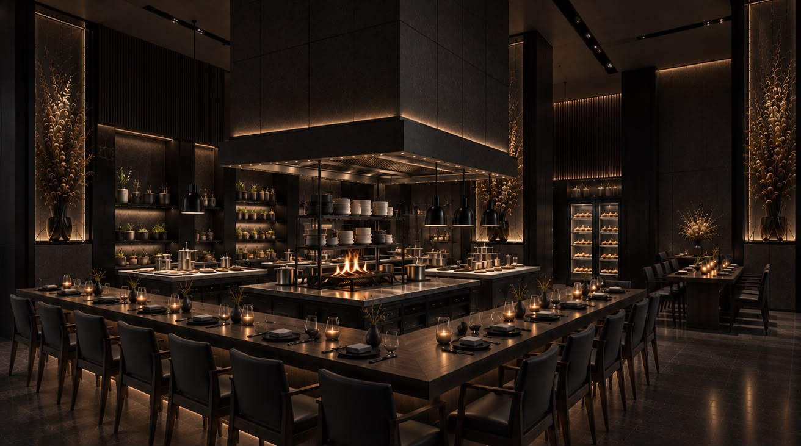

# bé



[bé](https://bebybenjampapp.vercel.app/)

## Description

Website to showcase fine dining restaurant's story and menu.

## Tech Stack

- Astro (static output, zero client-side JavaScript)
- Tailwind CSS v4
- TypeScript
- Vercel

## Getting started

Requires Node 22.12 or newer (see `.nvmrc`).

```bash
npm install
npm run dev      # local dev server at localhost:4321
npm run build    # static build into dist/
npm run preview  # serve the built output
npm run check    # type-check .astro and .ts files
npm run format   # Prettier
```

## Project layout

```
public/          served as-is (fonts, favicon, robots.txt, og.jpg)
src/assets/      images processed by Astro; only imported files are bundled
src/components/  Nav, Footer, Wordmark, InstagramIcon, Seo
src/data/        site.ts (restaurant details), menu.ts (tasting menu)
src/layouts/     Base.astro — html shell, head, nav and footer
src/pages/       file-based routes: index.astro -> /, menu.astro -> /menu
src/styles/      global.css — Tailwind import, @font-face, @theme tokens
```

## Contributions

Designed and built by Hussein Fawaz

- [Portfolio](https://www.husseinfawaz.ca)
- [LinkedIn](https://www.linkedin.com/in/hsnfwz)
- [GitHub](https://www.github.com/hsnfwz)
